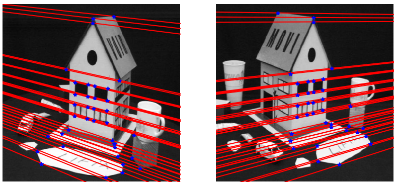
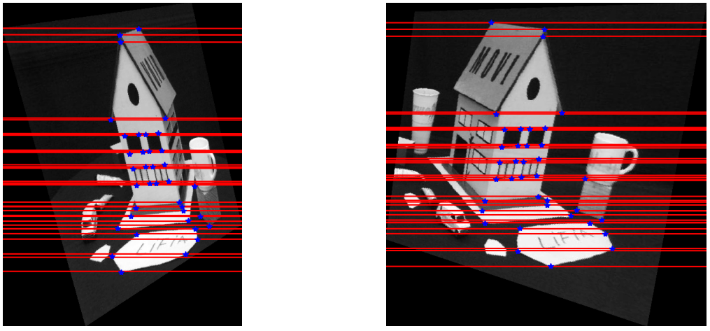

# Stereo Rectification 

Stereo Rectification is the process of making any two given images parallel such that the epipolar lines are aligned and parallel to the image horizontal axis. This requires generating two homography matrices H1, and H2 for left and right images respectively.

First step in the process is to compute a homography matrix, H2, which moves the right image epipole to infinity along the horizontal axis, thereby making the epipolar lines parallel. Next, the homography matrix, H1, is computed which transforms the left image such that the epipolar lines in left and right images are parallel.

Given both homography matrices, rectified images can be computed using inverse pixel mapping.

Stereo Image Pair as captured from the camera  |  Rectified Stereo Image Pair
:----------------------------:|:-------------------------:
  |  